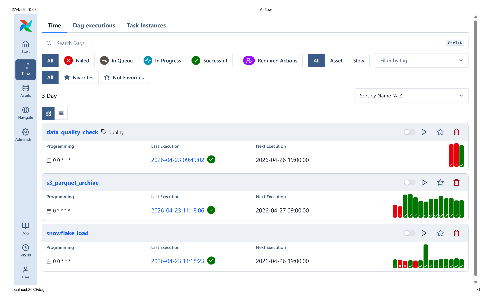
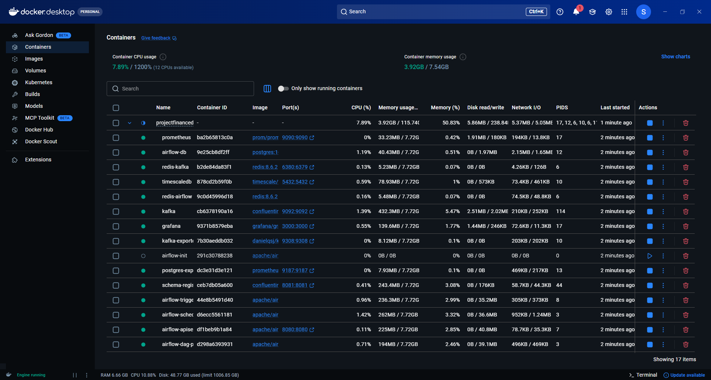
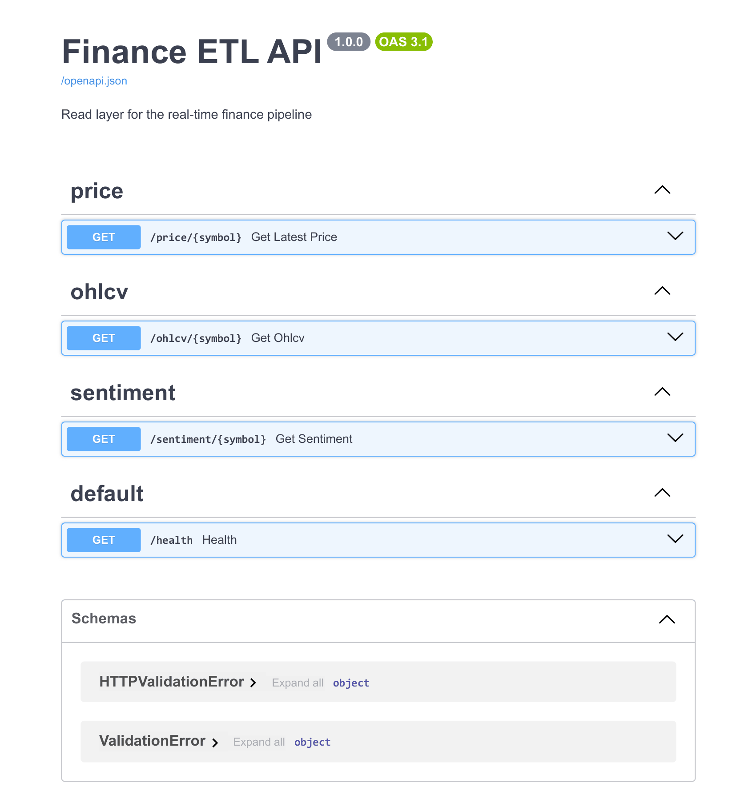
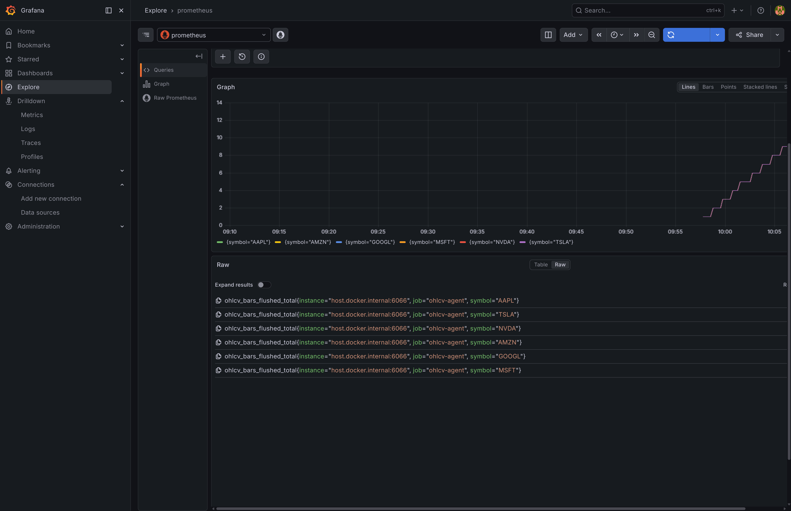
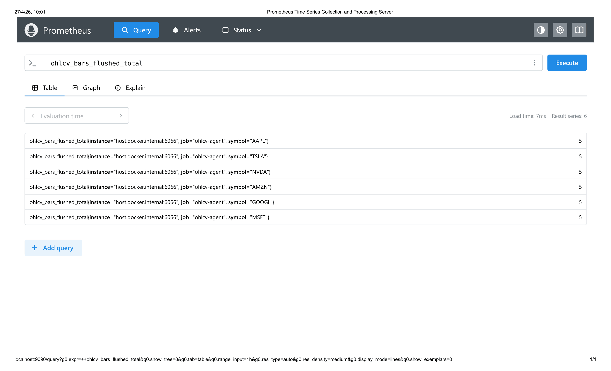

<h1>Stock Market Streaming Data Pipeline</h1>
This project implements a streaming data pipeline to get real-time data on the prices of stock market symbols, such as AAPL, MSFT, NVDA, etc.

<h2>Project Structure</h2>

```text
.
├── api/                # FastAPI for real-time data monitoring
├── config/             # Airflow configuration
├── dags/               # Airflow DAGs definition
├── observability/      # Prometheus yml file definitions for observability
├── plugins/            # Additional features
├── processors/         # Kafka processors (consumers)
├── producers/          # Kafka producers (including base_producer class)
├── quality/            # Data quality monitoring
├── schemas/            # Avro schemas defintion
├── tests/              # Tests definitions
├── .env.example        # Example of .env file (make sure to configure yourself)
├── docker-compose.yml  # docker containers definitions
├── Makefile            # useful shortcuts not to write too many command lines
├── README.md           # This file
└── requirements.txt    # package requirements
```


<h2>Streaming Pipeline</h2>

The streaming pipeline is designed to retrieve stock market and news information from different APIs.

<h3>Producers</h3>

- Real-Time Alpaca Producer: This producer is in charge of asking stock prices for the symbols previously defined at a real-time processing. It is important to highligh that this producer only works actively when stock markets are opened, which for the American standard is meant to be from 9:30 a.m. to 4:00 p.m. ET. on weekdays. Otherwise, the producer will not obtain any information to publish in the topics.

- Yahoo Rest Producer: This producer is meant to be an alternative to the Alpaca Producer in case of failures. It is meant to retrieve information on symbols prices every 5 minutes and it works actively even when stock markets are not active, though the prices will remain the same.

- News Producer: This producer obtains information on all the latest news that involve the symbols previously defined. News with a title like "Apple presents its revenues for the last quarter with a dramatic increase", and that contain tags that link the symbols that were defined (AAPL for the case of Apple) will be published into a specific topic by this producer.

- Base Producer: This is not a specific producer, but a base class from which all the previous producers will be inheriting properties and methods. It is build appart for better readability.


<h3>Processors</h3>

- Sentiment Agent: This processor (or consumer) is in charge of analyzing the registers published into the news topic from the News Producer. It is meant to analyze the title and description of the news published using the Vader Sentiment library, and lately define whether the new is positive, negative or neutral. This information is meant to work as a parameter to define models and estimations for investment strategies.

- OHLCV Agent: OHLCV stands for Open, High, Low, Close, Volumen, and these are parameters that are constant when analyzing stock prices in certain ranges. This consumer will get the information on prices that is published in the raw_ticks topic used by the Alpaca and Yahoo producers. During a 1 minute window, this consumer takes the different prices that it receives and comprises into a OHLCV register that is lately saved into a Timescale Database (meant for real-time information which is drop after some days).

- DLQ Agent: As its name indicates, this consumer will take care of the wrongly published registers and publish them into a raw.dlq topic. It also save the information into the Timescale Database to analyze them lately.

- Anomaly Agent: This processor is subscribed to the raw.ticks topic (symbols prices) and will analyze whether the prices have a natural behaviour or are anomalous. If they're anomalous, then the information is saved into the Timescale Database.


<h3>Topics</h3>
There are 3 total topics involved that are defined and created in the Makefile with the .Phony: make topics. The first one is <strong>raw.ticks</strong>, for which the produced ticks from the yahoo_rest_producer and the alpaca_ws_producer publish on. On the other hand, all the DLQs are published up to the <strong>raw.dlq</strong> topic. Additionally, there's a <strong>raw.news</strong> topic into which news_producer registers are published.

<h2>docker-compose</h2>
Here, I am going to list the main containers that have been defined inside the docker-compose file for the project to work properly:
- Airflow.
- Kafka.
- Schema-Registry.
- TimescaleDB.
- Redis.
- Prometheus.
- Grafana.
Of course, most of these services involve several containers. For instance, to define the whole Airflow service, it is necessary to define the apiserver, triggerer, dag-processor, redis (for cache), etc. On the other hand, for services like Kafka and TimescaleDB, it was necessary to add exporters so that the Prometheus container meant for observability could detect the flows in those containers and so obtain metrics.

&emsp;Furthermore, there are 2 Redis containers defined in there, so that one is specifically to be used by the Kafka service, and the other one for the Airflow service and so there are no collissions.

&emsp;As this projet is not meant to go to production yet, no networks were defined. Nonetheless,  some volumes needed to be defined to save database information, as well as airflow dags historical works.


<h2>Airflow DAGs</h2>

It has been considered 3 dags in total to work in this project. The first one is called data_quality_check, and as its name indicates, it is meant to check data quality in the ohlcv bars as well as the news sentiment agent. It checks up the TimescaleDB and look for rows with specific aspects or wrong registers. The DAG fails if there are any data quality failures.

&emsp;On the other hand, there is a s3_parquet_archive DAG, for which the new ohlcv records are published into a .parquet file that is saved into an S3 Bucket with a parquet structure. It is triggered every hour looking for the registers of the last hour of execution of the application that are in the TimescaleDB.

&emsp;Finally, there's a snowflake_load DAG that takes the registers inside the S3 Bucket and published them into a fact table on Snowflake, so that later real-time analytics can take place.

<h2>Observability</h2>
Observability is handle through a Prometheus container that takes information from the following containers and agents: kafka, ohlcv_agent, anomaly_agent, sentiment_agent, dlq_agent, fastapi, and timescaledb. Most of the ports listed in the prometheus.yml file are initialized with the processors (consumers) applications. In this way, it is possible to perform some requests to the agents and confirm everything is working as expected.

&emsp; The fastAPI that is implemented here is meant to give a better experience at observability, as it allows the user to perform requests for real-time registers for ohlcv ticks or news that are being processed at that very moment.


<h2>Images of the Project</h2>
Here are some images of the UIs and the processes working.

<h3>Airflow</h3>


<h3>Docker</h3>


<h3>FastAPI</h3>


<h3>Grafana</h3>


<h3>Prometheus</h3>



<h2>Author</h2>
Santiago Ortiz Quintero | Engineering Physicist | Data Engineer/Analyst<br>

https://github.com/SantiOrtizQ<br>
https://www.linkedin.com/in/santiortizq/